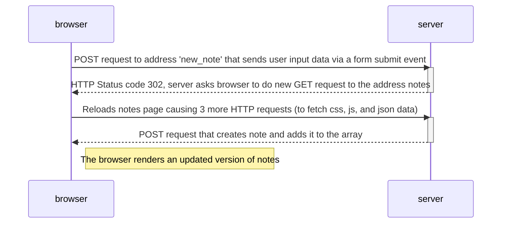

## 0.4: New note diagram

# 0.5: Single page app diagram

When the user visits the SPA (Single Page Application) version of the notes page it will look essentially the same to them. However, there are some key differences:

- It is comprised of only one HTML page, instead of multiple, and that page is updated by JavaScript executing in the browser.
- The HTML form-tag is defined differently. It does not contain action or method attribute to define where to send the data.

# 0.6: New note in Single page app diagram

