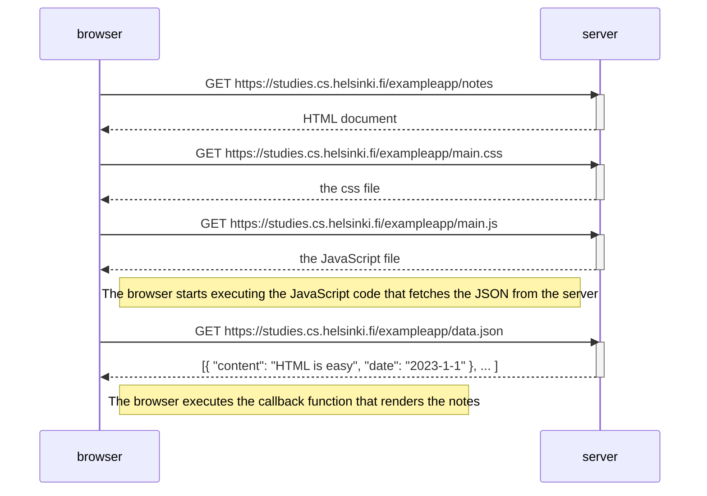

```mermaid

sequenceDiagram
participant browser
participant server

    browser->>server: POST request to address 'new_note' that sends user input data via a form submit event
    activate server
    server-->>browser: HTTP Status code 302, server asks browser to do new GET request to the address notes
    deactivate server

    browser->>server: Reloads notes page causing 3 more HTTP requests (to fetch css, js, and json data)
    activate server
    server-->>POST request that creates note and adds it to the array
    deactivate server

    Note right of browser: The browser renders an updated version of notes

```
